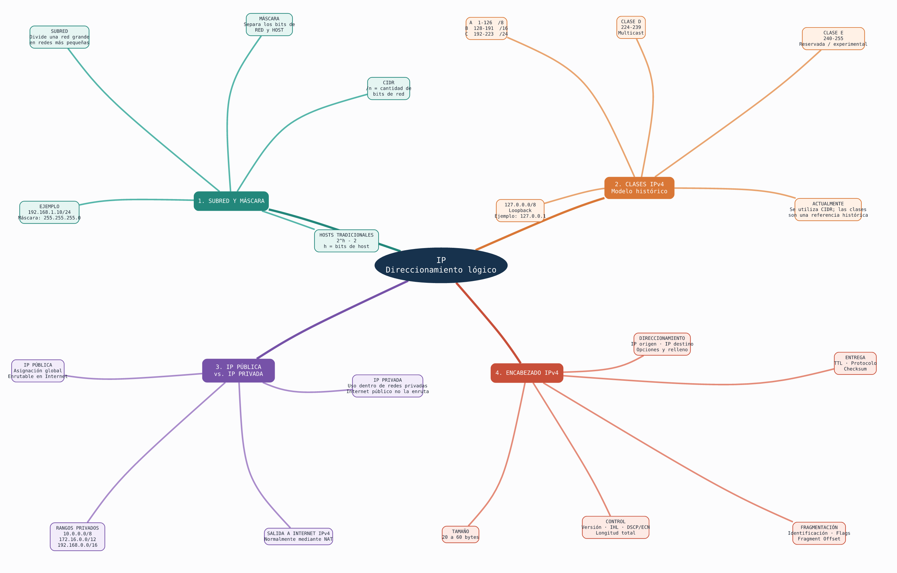
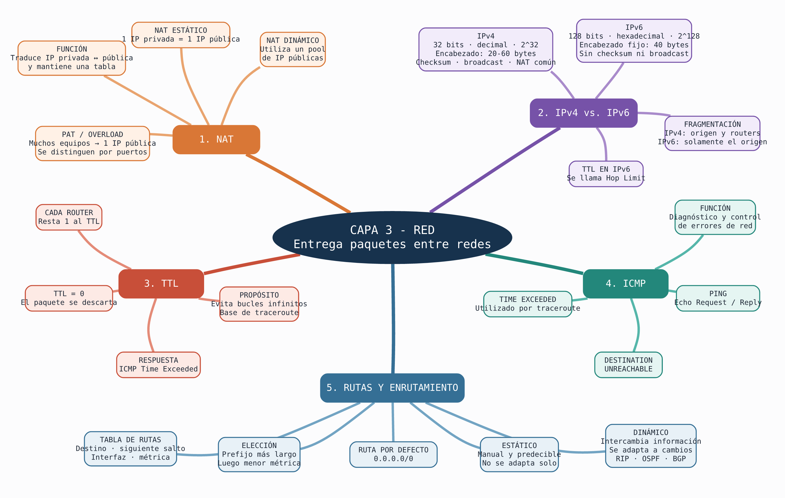
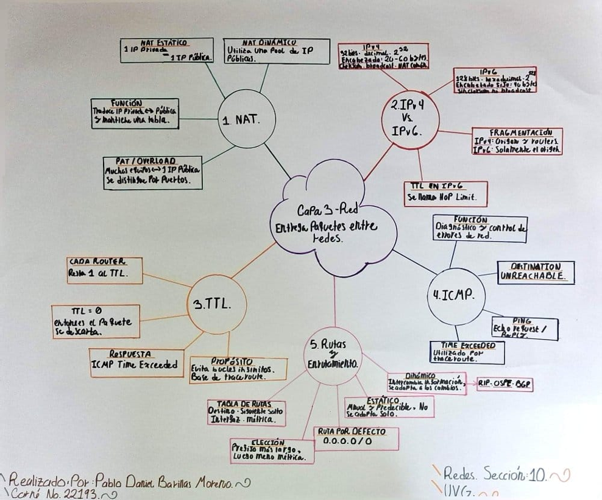

<div align="center">

# 🌐 Síntesis y Mapa Mental L3

### Redes de Computadoras · Capa 3 — Red

**Universidad del Valle de Guatemala**  
**Estudiante:** Pablo Daniel Barillas Moreno · **Carné:** 22193  
**Sección:** 10

</div>

---

## Descripción de la actividad

La actividad consiste en sintetizar los principales conceptos de la **Layer 3 (Capa 3)** del modelo OSI mediante dos mapas mentales elaborados a mano, preferentemente en papel. Cada mapa organiza de manera visual las funciones, características y protocolos estudiados en clase.

La entrega final se realiza mediante GitHub e incluye dos mapas mentales hechos a mano:

1. Un mapa mental sobre **IP (Internet Protocol)**.
2. Un mapa mental sobre **Layer 3 (Capa 3)**.

Como base se utilizó la presentación de clase sobre Capa 3 y se amplió la información mediante documentos técnicos oficiales publicados por la **Internet Engineering Task Force (IETF)**.

Antes de elaborar los mapas en papel, se crearon dos diagramas digitales mediante archivos fuente en formato **Graphviz DOT (`.dot`)**. Estos archivos permitieron organizar los conceptos, establecer la jerarquía de las ramas y comprobar que la información fuera legible. Posteriormente, los diagramas se renderizaron como imágenes y se utilizaron como guía para reproducir manualmente los mapas mentales incluidos como evidencia final.

---

## Proceso de elaboración

El trabajo se desarrolló en las siguientes etapas:

1. **Revisión del contenido:** se identificaron los conceptos solicitados en la presentación de clase y se amplió la información con RFC oficiales.
2. **Diseño en Graphviz:** se construyeron los mapas iniciales mediante dos archivos `.dot`, uno para IP y otro para Capa 3.
3. **Renderizado de los diagramas:** los archivos `.dot` se convirtieron en imágenes PNG para revisar la distribución, el orden de las ramas y la legibilidad del contenido.
4. **Elaboración manual:** las imágenes renderizadas se utilizaron como referencia para dibujar los mapas mentales a mano y fotografiarlos como evidencia final de la actividad.

---

## Objetivos

- Identificar las funciones principales de la Capa 3 del modelo OSI.
- Comprender el direccionamiento lógico proporcionado por IP.
- Diferenciar IPv4 de IPv6 y las direcciones públicas de las privadas.
- Explicar la función de NAT, TTL, ICMP y las tablas de enrutamiento.
- Comparar el enrutamiento estático con el enrutamiento dinámico.
- Organizar previamente la información mediante diagramas `.dot`.
- Presentar la información de forma resumida, visual y ordenada mediante mapas hechos a mano.

---

## Requisitos de la entrega

- Elaborar **dos mapas mentales a mano**, preferentemente en papel.
- Utilizar palabras clave, ramas, colores y conexiones fáciles de identificar.
- Tomar fotografías claras, bien iluminadas y sin partes recortadas.
- Conservar los archivos `.dot` empleados para planificar los mapas.
- Incluir las imágenes renderizadas a partir de los archivos `.dot`.
- Incluir las fotografías finales de los mapas elaborados a mano.
- Mantener la estructura y los nombres de archivos indicados para evitar enlaces rotos.
- Subir el `README.md`, los archivos fuente y todas las imágenes al repositorio de GitHub.

---

## Contenido de los mapas mentales

| Evidencia | Tema central | Conceptos incluidos |
| --- | --- | --- |
| **Mapa 1** | IP | Subred y máscara de subred; clases de IPv4; IP pública frente a IP privada; encabezado IPv4. |
| **Mapa 2** | Capa 3 | NAT; IPv4 frente a IPv6; TTL; ICMP; rutas y enrutamiento estático frente a dinámico. |

---

## Archivos fuente `.dot`

Los siguientes archivos contienen la estructura digital utilizada para organizar inicialmente los mapas mentales:

| Diagrama | Ruta relativa | Acceso |
| --- | --- | --- |
| Fuente del mapa sobre IP | `./diagramas/mapa-mental-ip.dot` | [Abrir archivo DOT](./diagramas/mapa-mental-ip.dot) |
| Fuente del mapa sobre Capa 3 | `./diagramas/mapa-mental-capa3.dot` | [Abrir archivo DOT](./diagramas/mapa-mental-capa3.dot) |

Los diagramas pueden volver a renderizarse con Graphviz mediante los siguientes comandos:

```bash
neato -Tpng ./diagramas/mapa-mental-ip.dot -o ./imagenes/renderizadas/mapa-mental-ip-renderizado.png
neato -Tpng ./diagramas/mapa-mental-capa3.dot -o ./imagenes/renderizadas/mapa-mental-capa3-renderizado.png
```

---

## Mapa 1 — IP

Este mapa presenta a IP como el protocolo encargado del direccionamiento lógico. Explica cómo una máscara separa la parte de red de la parte de host, resume las clases históricas de IPv4, distingue las direcciones públicas de las privadas y organiza los campos principales del encabezado IPv4.

### Archivos del mapa sobre IP

| Tipo de archivo | Ruta relativa |
| --- | --- |
| Fuente Graphviz DOT | `./diagramas/mapa-mental-ip.dot` |
| Imagen renderizada desde DOT | `./imagenes/renderizadas/mapa-mental-ip-renderizado.png` |
| Fotografía del mapa hecho a mano | `./imagenes/hechas-a-mano/mapa-mental-ip-hecho-a-mano.png` |

### Comparación del proceso

| Diseño renderizado desde el archivo `.dot` | Mapa reproducido a mano |
| :---: | :---: |
|  |  |
| *Guía digital para distribuir los conceptos.* | *Evidencia final elaborada manualmente.* |

### Conceptos representados

- **Subnet (subred):** división lógica de una red en redes más pequeñas.
- **Subnet mask (máscara de subred):** identifica qué bits pertenecen a la red y cuáles al host.
- **IPv4 classes (clases de IPv4):** clasificación histórica en clases A, B, C, D y E.
- **Public IP (IP pública):** dirección globalmente asignada y enrutable en Internet.
- **Private IP (IP privada):** dirección utilizada dentro de redes privadas y no enrutada por el Internet público.
- **IPv4 header (encabezado IPv4):** contiene información de control, fragmentación, protocolo, TTL y direcciones de origen y destino.

---

## Mapa 2 — Capa 3

Este mapa resume cómo la Capa 3 entrega paquetes entre redes diferentes. Incluye la traducción de direcciones mediante NAT, las diferencias entre IPv4 e IPv6, el control de vida de los paquetes con TTL, los mensajes de diagnóstico ICMP y la forma en que los routers seleccionan una ruta.

### Archivos del mapa sobre Capa 3

| Tipo de archivo | Ruta relativa |
| --- | --- |
| Fuente Graphviz DOT | `./diagramas/mapa-mental-capa3.dot` |
| Imagen renderizada desde DOT | `./imagenes/renderizadas/mapa-mental-capa3-renderizado.png` |
| Fotografía del mapa hecho a mano | `./imagenes/hechas-a-mano/mapa-mental-capa3-hecho-a-mano.png` |

### Comparación del proceso

| Diseño renderizado desde el archivo `.dot` | Mapa reproducido a mano |
| :---: | :---: |
|  |  |
| *Guía digital para distribuir los conceptos.* | *Evidencia final elaborada manualmente.* |

### Conceptos representados

- **NAT (Network Address Translation):** traduce direcciones privadas a públicas; puede ser estático, dinámico o utilizar PAT.
- **IPv4 frente a IPv6:** IPv4 utiliza direcciones de 32 bits, mientras que IPv6 utiliza direcciones de 128 bits.
- **TTL (Time to Live):** disminuye en cada router y evita que un paquete circule indefinidamente.
- **ICMP (Internet Control Message Protocol):** comunica errores y permite diagnósticos mediante herramientas como `ping` y `traceroute`.
- **Routing (enrutamiento):** proceso utilizado por un router para seleccionar el mejor camino hacia una red de destino.
- **Static routing (enrutamiento estático):** rutas configuradas manualmente.
- **Dynamic routing (enrutamiento dinámico):** rutas aprendidas y actualizadas mediante protocolos como RIP, OSPF o BGP.

---

## Estructura del repositorio

```text
actividad-redes-mapa-mental-l3/
├── README.md
├── LICENSE
├── diagramas/
│   ├── mapa-mental-ip.dot
│   └── mapa-mental-capa3.dot
└── imagenes/
    ├── renderizadas/
    │   ├── mapa-mental-ip-renderizado.png
    │   └── mapa-mental-capa3-renderizado.png
    └── hechas-a-mano/
        ├── mapa-mental-ip-hecho-a-mano.png
        └── mapa-mental-capa3-hecho-a-mano.png
```

---

## Conclusión

La Capa 3 permite la comunicación entre redes diferentes mediante direccionamiento lógico y enrutamiento de paquetes. IP identifica el origen y el destino, mientras que mecanismos como NAT, TTL e ICMP apoyan la traducción de direcciones, el control de los paquetes y el diagnóstico de problemas. Las tablas de enrutamiento permiten seleccionar el camino adecuado, ya sea mediante rutas configuradas manualmente o aprendidas dinámicamente.

El uso inicial de archivos `.dot` permitió planificar la distribución de los conceptos y verificar la legibilidad de cada mapa. Las imágenes renderizadas funcionaron como una guía visual para trasladar el contenido al papel, mientras que las fotografías de los mapas hechos a mano documentan el resultado final solicitado en la actividad.

---

> ### Referencias APA 7.ª edición de la tarea de Redes: Síntesis y Mapa Mental L3

Deering, S., & Hinden, R. (2017, julio). *Internet Protocol, version 6 (IPv6) specification* (RFC 8200). Internet Engineering Task Force. [https://datatracker.ietf.org/doc/html/rfc8200](https://datatracker.ietf.org/doc/html/rfc8200)

Fuller, V., & Li, T. (2006, agosto). *Classless inter-domain routing (CIDR): The Internet address assignment and aggregation plan* (RFC 4632). Internet Engineering Task Force. [https://datatracker.ietf.org/doc/html/rfc4632](https://datatracker.ietf.org/doc/html/rfc4632)

Mogul, J., & Postel, J. (1985, agosto). *Internet standard subnetting procedure* (RFC 950). Internet Engineering Task Force. [https://datatracker.ietf.org/doc/html/rfc950](https://datatracker.ietf.org/doc/html/rfc950)

Moy, J. (1998, abril). *OSPF version 2* (RFC 2328). Internet Engineering Task Force. [https://datatracker.ietf.org/doc/html/rfc2328](https://datatracker.ietf.org/doc/html/rfc2328)

Postel, J. (1981a, septiembre). *Internet Control Message Protocol* (RFC 792). Internet Engineering Task Force. [https://datatracker.ietf.org/doc/html/rfc792](https://datatracker.ietf.org/doc/html/rfc792)

Postel, J. (1981b, septiembre). *Internet Protocol* (RFC 791). Internet Engineering Task Force. [https://datatracker.ietf.org/doc/html/rfc791](https://datatracker.ietf.org/doc/html/rfc791)

Rekhter, Y., Moskowitz, B., Karrenberg, D., de Groot, G. J., & Lear, E. (1996, febrero). *Address allocation for private internets* (RFC 1918). Internet Engineering Task Force. [https://datatracker.ietf.org/doc/html/rfc1918](https://datatracker.ietf.org/doc/html/rfc1918)

Reynolds, J., & Postel, J. (1994, octubre). *Assigned numbers* (RFC 1700). Internet Engineering Task Force. [https://datatracker.ietf.org/doc/html/rfc1700](https://datatracker.ietf.org/doc/html/rfc1700)

Srisuresh, P., & Egevang, K. (2001, enero). *Traditional IP network address translator (Traditional NAT)* (RFC 3022). Internet Engineering Task Force. [https://datatracker.ietf.org/doc/html/rfc3022](https://datatracker.ietf.org/doc/html/rfc3022)

---

<div align="center">

**Redes de Computadoras · Síntesis y Mapa Mental L3**

</div>